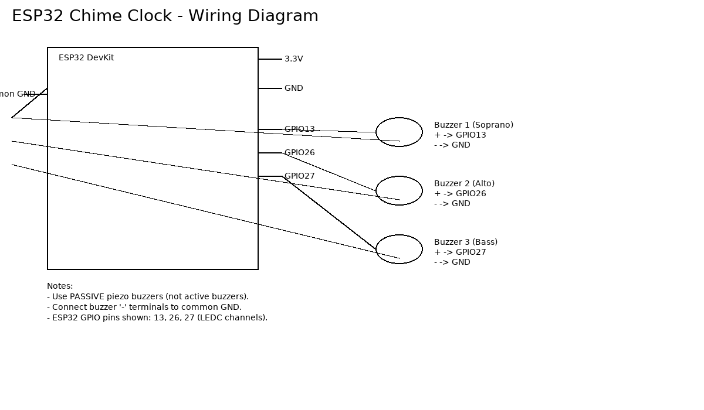

# ⏰ ESP32 Buzzer Chime Clock

A WiFi-synchronized musical chime clock that plays different three-part harmonized songs every hour.  
Built on an ESP32 using LEDC PWM audio, NTP time synchronization, and customizable schedules.

---

## ✨ Features

- 🎵 **Three independent buzzer voices** (three-part harmony)
- ⏱️ **NTP time sync over WiFi** (accurate to the second)
- 🕒 **Hourly chimes** with fully customizable songs
- 📅 **Special scheduled events** (e.g., Sundays at 9:30 AM)
- 🔊 **Uses LEDC hardware PWM** — no tone() conflicts
- 🚫 Plays non-blocking (your loop remains free)
- 📦 Simple modular architecture

---

## 📁 Project Structure

```
/project-folder
│
├── main.ino               // main program, songs, scheduler
├── TimeManager.ino           // WiFi + NTP utilities
├── README.md              // this file
├── HowGreatThouArt.ino
├── AngelsWeHaveHeardOnHigh.ino
├── WestminsterChimes.ino
└── wiring_diagram.png     // your generated wiring image
```

---

## 🔌 Wiring Diagram

The clock uses **three passive buzzers** driven by the ESP32's LEDC PWM channels.



### Pin Connections

| Part            | ESP32 Pin   | Notes             |
| --------------- | ----------- | ----------------- |
| Buzzer 1        | **GPIO 13** | LEDC channel 0    |
| Buzzer 2        | **GPIO 26** | LEDC channel 2    |
| Buzzer 3        | **GPIO 27** | LEDC channel 4    |
| All Buzzers VCC | **3.3V**    |                   |
| All Buzzers GND | **GND**     | Must share ground |

---

## ⚙️ Installation & Setup

### 1. Install ESP32 Board Package

Arduino IDE → **Boards Manager** → search **ESP32** → install.

### 2. Required Libraries

All libraries are built-in:

- `<WiFi.h>`
- `<WiFiUdp.h>`
- `<NTPClient.h>`

### 3. Add Your WiFi Credentials

In **TimeManager.ino**:

```cpp
const char* WIFI_SSID     = "YourNetwork";
const char* WIFI_PASSWORD = "YourPassword";
```

---

## ⏱️ Time Synchronization

The ESP32 connects to WiFi on boot and uses NTP to obtain UTC time, then converts to local time each loop.

Functions provided:

```cpp
// Fires once per day at EXACT hour/minute
bool isTime(int hour, int minute)

// Fires once per week at exact time + exact day
bool isTimeAndDay(int hour, int minute, int day)

// Fires once every hour on the hour (hh:00:00)
bool isHourly()
```

---

## 🎼 Creating Songs

Songs use arrays:

```cpp
const int notes1[] = { C4, E4, G4, 0 };
const int dur1[]   = { q,  q,  h,  q };

const int notes2[] = { G3, B3, D4, 0 };
const int dur2[]   = { q,  q,  h,  q };

const int notes3[] = { C3, G3, E3, 0 };
const int dur3[]   = { q,  q,  h,  q };
```

Then register with:

```cpp
startSong(notes1, dur1, len1,
          notes2, dur2, len2,
          notes3, dur3, len3);
```

---

## 📡 LEDC Audio Output

This project uses hardware PWM:

- Channel 0 → GPIO 13
- Channel 2 → GPIO 26
- Channel 4 → GPIO 27

LEDC is **non-blocking** and allows 3 tones to play simultaneously without conflict.

---

## 📦 Future Ideas

- Add volume control using a MOSFET
- Add OLED or TFT display
- Add web UI for selecting songs
- Use DFPlayer mini instead of buzzers

---

## 🤝 Contributions

Pull requests and enhancements are welcome.

---

## 📜 License

MIT License — free to use, modify, and distribute.
